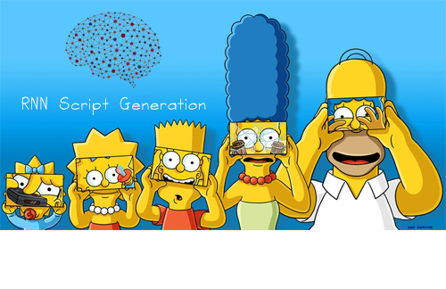
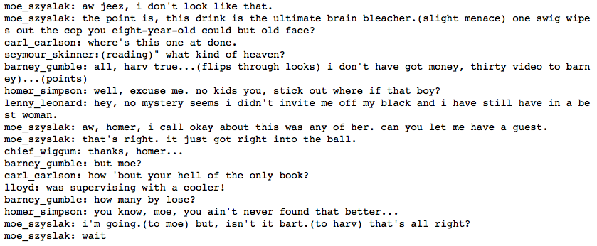

# The Simpsons Script Generation

## Project Overview

In this project, I've completed a jupyter notebook as a part of Udacity's Deep Learning Nanodegree. The code in the notebook allows the generation of your own Simpsons TV scripts using Recurrent Neural Networks.

In order to train the network, I used part of the Simpsons dataset of scripts from 27 seasons which only consist of scenes from Moe's Taver. After training, the Neural Network is able to generate a new TV script for a scene at Moe's Tavern.

As mentioned, the model's architecture is based on Recurrent Neural Network consisting basic LSTM cells. Furthermore, I used Word Embedding in order to represent the large amount of different words more efficiently and give the Network the ability to learn semantic relationships between words which is necessary to generate complete sentences. The model was built using TensorFlow.

Please note that training the model with the given data set will most likely generate nonsensical script since it was trained only on a subset of a bigger dataset. In the example below, we can see that the model is able to generate sentences with punctuation where each sentence is attributed to a specific character from The Simpsons. Even though the script doesn't make so much sense, it is very entertaining to read :)

## Project Instructions

### Instructions

In order to train the model and generate a new TV script, run all cells in the notebook. I recommend you use a GPU when training the Network.

Finally, if you want to train the model on more data, you can use the complete [Simpsons dataset](https://www.kaggle.com/wcukierski/the-simpsons-by-the-data).
